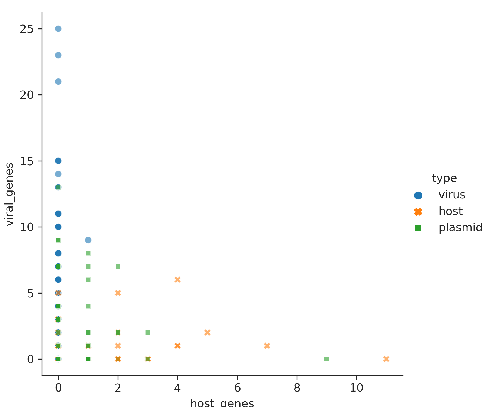

Review of viral identification benchmark by stanley et al 2021
================
Jiarong Guo

# Motivation

There is a recent
[preprint](https://www.biorxiv.org/content/10.1101/2021.04.12.438782v1), "Comprehensive benchmarking of tools to identify phages in metagenomic shotgun sequencing data",
on benchmark of 10 common viral identification tools, which shows
gene-based tools including VirSorter2 have poor performance (\< 0.8
accuracy) in simulated data from Refseq genomes (Fig.1). This is,
however, in contrast to the benchmark I did with VirSorter2
(<https://doi.org/10.1186/s40168-020-00990-y>) (Fig.3), where most tools
performed very well (>0.9 accuracy) with simulated data from RefSeq
genomes. After discussing with Dr.Simon Roux and Dr.Matt Sullivan
(coauthors of VirSorter2), we think below are factors that could cause
such poor performance:

-   Contig length cutoff
-   The additon of plasmid sequences and its large proportion in the
    data

Here my goal is to find out the reasons for low performance of
VirSorter2 in this preprint, NOT to compare kmer-based
(e.g. DeepVirFinder) and gene-based tools. Kmer-based tools are better
with short contigs, but have its weakness, which [this
article](https://doi.org/10.3389/fmicb.2019.00806) have extensive
discussion on.

# Data analyses

I will walk through the data exploration in this section. For the
impatient, you can go directly to the [summary section](#summary). To
find out the reason, I decided to run VirSorter2 on the same benchmark
data (I appreciate the authors’ quick response). Since the simulated
data are quite large, I subset it to reduce the computation time and I
also added the contig origin as prefix to contig names. You can get the
files used here by the following commands:

    # install two more packages in addition to those in VirSorter2 SOP
    conda install -c conda-forge -c bioconda screed seaborn

    # get the necessary files
    git clone https://github.com/jiarong/2021-08-viral-identification-benchmark-review.git
    cd 2021-08-viral-identification-benchmark-review
    ls *

Here are the files you should see:

    2021-08-viral-identification-benchmark-review.Rproj  LICENSE  report.Rmd

    plasmid:
    dramv-annotation.tsv  vs2-checkv-merged.tsv  vs2sop-len5k.fa

    scripts:
    seqlen.py

    simulated:
    all.sub0d01.fa.gz  dramv-annotation.tsv  vs2-checkv-merged.tsv  vs2sop-len5k.fa

Then I follow VirSorter2
[SOP](dx.doi.org/10.17504/protocols.io.bwm5pc86) to identify, quality
check, and annotate viral sequences (the starting contig file is
`simulated/all.sub0d01.fa`). Here I will skip the details of the SOP and
go direclty to the results. Here are the related files:

-   `simulated/vs2sop-len5k.fa`: Virsorter2 SOP identified viral contigs
-   `simulated/vs2-checkv-merged.tsv`: VirSorter2 score table and checkV
    contamination table merged
-   `simulated/dramv-annotation.tsv`: DRAMv gene annotation of
    identified viral contigs

First, I want to double check if the my results is consistent with the
preprint:

``` bash
conda activate R # skip this line, specific to my computer
Len=1000
echo "*** Total virus, host, and plasmid counts:"
python scripts/seqlen.py simulated/all.sub0d01.fa.gz | awk -v Len=$Len '$2 >=Len' | cut -d"_" -f1 | sort | uniq -c | tr -s ' ' | sed 's/^\s//'
echo "*** Virus, host, and plasmid counts in VirSorter2 results with a score cutoff of 0.93:"
cat simulated/vs2-checkv-merged.tsv | awk -v Len=$Len '($4>=0.93 || $4=="nan") && $6 >=Len' | cut -f1 -d"_" | sort | uniq -c | grep -v 'seqname' | tr -s ' ' | sed 's/^\s//'
```

    ## *** Total virus, host, and plasmid counts:
    ## 3289 host
    ## 1055 plasmid
    ## 81 virus
    ## *** Virus, host, and plasmid counts in VirSorter2 results with a score cutoff of 0.93:
    ## 13 host
    ## 24 plasmid
    ## 62 virus

With the above results, we get the performance stats below:
<table class=" lightable-classic-2" style="font-family: &quot;Arial Narrow&quot;, &quot;Source Sans Pro&quot;, sans-serif; width: auto !important; margin-left: auto; margin-right: auto;">
<caption>
VirSorter2 predictions using 0.93 score cutoff and 1kb length cutoff w/o
data correction on simulated data
</caption>
<thead>
<tr>
<th style="text-align:left;">
</th>
<th style="text-align:center;">
actual_virus
</th>
<th style="text-align:center;">
actual_nonvirus
</th>
</tr>
</thead>
<tbody>
<tr>
<td style="text-align:left;">
predicted_virus
</td>
<td style="text-align:center;">
62
</td>
<td style="text-align:center;">
38
</td>
</tr>
<tr>
<td style="text-align:left;">
predicted_nonvirus
</td>
<td style="text-align:center;">
19
</td>
<td style="text-align:center;">
4307
</td>
</tr>
</tbody>
</table>
<table class=" lightable-classic-2" style="font-family: &quot;Arial Narrow&quot;, &quot;Source Sans Pro&quot;, sans-serif; width: auto !important; margin-left: auto; margin-right: auto;">
<thead>
<tr>
<th style="text-align:center;">
recall
</th>
<th style="text-align:center;">
precision
</th>
<th style="text-align:center;">
F1
</th>
</tr>
</thead>
<tbody>
<tr>
<td style="text-align:center;">
0.765
</td>
<td style="text-align:center;">
0.62
</td>
<td style="text-align:center;">
0.685
</td>
</tr>
</tbody>
</table>

We can see the benchmark stats are consistent with results in preprint.

## Impact of contig length cutoff

It’s known that gene based tools are not good at short contigs with
length \<5kb, since at least a few genes are required for such tools to
get features such as gene density and strand switch frequency needed for
prediction. The benchmark in the preprint set the length cutoff at 1kb,
which puts gene based tools at disadvantage. Since they pick random
fragments between 1kb and 15kb, we can expect about 1/3 of the contigs
are not proper for gene based tools. Thus I would expect some
performance improvement with contigs \>5kb.

``` bash
conda activate R # skip this line, specific to my computer
Len=5000
echo "*** Total virus, host, and plasmid counts with a length cutoff of 5kb:"
python scripts/seqlen.py simulated/all.sub0d01.fa.gz | awk -v Len=$Len '$2 >=Len' | cut -d"_" -f1 | sort | uniq -c | tr -s ' ' | sed 's/^\s//'
echo "*** Virus, host, and plasmid counts in VirSorter2 results with a length cutoff of 5kb and a score cutoff of 0.93:"
cat simulated/vs2-checkv-merged.tsv | awk -v Len=$Len '($4>=0.93 || $4=="nan") && $6 >=Len' | cut -f1 -d"_" | sort | uniq -c | grep -v 'seqname' | tr -s ' ' | sed 's/^\s//'
```

    ## *** Total virus, host, and plasmid counts with a length cutoff of 5kb:
    ## 2333 host
    ## 780 plasmid
    ## 51 virus
    ## *** Virus, host, and plasmid counts in VirSorter2 results with a length cutoff of 5kb and a score cutoff of 0.93:
    ## 4 host
    ## 14 plasmid
    ## 41 virus

With the above results, we have performance stats below:

<table class=" lightable-classic-2" style="font-family: &quot;Arial Narrow&quot;, &quot;Source Sans Pro&quot;, sans-serif; width: auto !important; margin-left: auto; margin-right: auto;">
<caption>
VirSorter2 predictions using 0.93 score cutoff and 5kb length cutoff w/o
data correction on simulated data
</caption>
<thead>
<tr>
<th style="text-align:left;">
</th>
<th style="text-align:center;">
actual_virus
</th>
<th style="text-align:center;">
actual_nonvirus
</th>
</tr>
</thead>
<tbody>
<tr>
<td style="text-align:left;">
predicted_virus
</td>
<td style="text-align:center;">
41
</td>
<td style="text-align:center;">
18
</td>
</tr>
<tr>
<td style="text-align:left;">
predicted_nonvirus
</td>
<td style="text-align:center;">
10
</td>
<td style="text-align:center;">
3095
</td>
</tr>
</tbody>
</table>
<table class=" lightable-classic-2" style="font-family: &quot;Arial Narrow&quot;, &quot;Source Sans Pro&quot;, sans-serif; width: auto !important; margin-left: auto; margin-right: auto;">
<thead>
<tr>
<th style="text-align:center;">
recall
</th>
<th style="text-align:center;">
precision
</th>
<th style="text-align:center;">
F1
</th>
</tr>
</thead>
<tbody>
<tr>
<td style="text-align:center;">
0.804
</td>
<td style="text-align:center;">
0.695
</td>
<td style="text-align:center;">
0.746
</td>
</tr>
</tbody>
</table>

The 5kb minimal contig length cutoff produces better performance stats
than 1kb, but still poor performance overall.

## Impact of large portion of plasmids in the data

From the above results, we can see plasmids are the main source of false
positives. As shown in the SOP, checkV is a very useful QC tools to show
viral signal (viral gene vs. host gene). We’ll have a closer look into
the plasmid hits using checkV output information.

``` python
import matplotlib.pyplot as plt
import seaborn as sb
import pandas as pd
sb.set_style('ticks')

tab = 'simulated/vs2-checkv-merged.tsv'
df = pd.read_csv(tab, sep='\t', header=0)
type_col = df['seqname'].map(lambda x: x.split('__', 1)[0])
df['type'] = type_col
#print(df.columns)

g = sb.relplot(data=df, x='host_genes', y='viral_genes', hue='type', style='type', alpha=0.6)
g.fig.savefig('checkv-viral-vs-host.png', dpi=300)
#plt.show()
```

<div class="figure" style="text-align: center">


<p class="caption">
checkV viral_gene vs. host_gene
</p>

</div>

#### Data correction w/ 1kb length cutoff

We can see the plasmids and hosts has many viral genes. The viral genes
defined in checkV are conservative, so they are fairly reliable viral
signals. To confirm the above, I search for three very obvious viral
hallmark genes, **terminase**, **tail** and **capsid** using the DRAMv annotations:

``` bash
# get contigs with score >= 0.93 and length >=1000
tail -n+2 simulated/vs2-checkv-merged.tsv | awk '$4 >=0.93 && $10 >=1000' | cut -f1 | sed -E 's/\|\|/__/' > simulated/keep-min-score-93.list
# count plasmid and host contigs with obvious viral genes
echo "*** Number of plasmid contigs with terminase, tail or capsid genes:"
grep -f simulated/keep-min-score-93.list simulated/dramv-annotation.tsv | grep "^plasmid__"  | grep -i -E "terminase|tail|capsid" | cut -f2| sort | uniq | wc -l
echo "*** Number of host contigs with terminase, tail or capsid genes:"
grep -f simulated/keep-min-score-93.list simulated/dramv-annotation.tsv | grep "^host__" | grep -E "terminase|tail|capsid" | cut -f2| sort | uniq | wc -l
```

    ## *** Number of plasmid contigs with terminase, tail or capsid genes:
    ## 17
    ## *** Number of host contigs with terminase, tail or capsid genes:
    ## 3

As we can see, there are **3** host and **17** plasmid contigs have one
of the three hallmark genes searched. By manually curating the rest of
the total 13 host and 25 plasmid sequence identified as virus with 1kb
length cutoff and 0.93 score cutoff, another **3** contigs are virial
with other hallmark genes, and there are another 3 contigs are
viral-like but are too short to make a confident call (these are treated
as nonviral here to be conservative). With the above finding, we have an
updated confusion matrix and performance stats below:

<table class=" lightable-classic-2" style="font-family: &quot;Arial Narrow&quot;, &quot;Source Sans Pro&quot;, sans-serif; width: auto !important; margin-left: auto; margin-right: auto;">
<caption>
VirSorter2 predictions using 0.93 score cutoff and 1kb length cutoff w/
data correction on simulated data
</caption>
<thead>
<tr>
<th style="text-align:left;">
</th>
<th style="text-align:center;">
actual_virus
</th>
<th style="text-align:center;">
actual_nonvirus
</th>
</tr>
</thead>
<tbody>
<tr>
<td style="text-align:left;">
predicted_virus
</td>
<td style="text-align:center;">
85
</td>
<td style="text-align:center;">
15
</td>
</tr>
<tr>
<td style="text-align:left;">
predicted_nonvirus
</td>
<td style="text-align:center;">
19
</td>
<td style="text-align:center;">
4307
</td>
</tr>
</tbody>
</table>
<table class=" lightable-classic-2" style="font-family: &quot;Arial Narrow&quot;, &quot;Source Sans Pro&quot;, sans-serif; width: auto !important; margin-left: auto; margin-right: auto;">
<thead>
<tr>
<th style="text-align:center;">
recall
</th>
<th style="text-align:center;">
precision
</th>
<th style="text-align:center;">
F1
</th>
</tr>
</thead>
<tbody>
<tr>
<td style="text-align:center;">
0.817
</td>
<td style="text-align:center;">
0.85
</td>
<td style="text-align:center;">
0.833
</td>
</tr>
</tbody>
</table>

#### Data correction w/ 5kb length cutoff

Again VirSorter2 are not good at short contigs. Now let’s try contig
length cutoff of 5kb.

``` bash
# get contigs with score >= 0.93 and length >=5000
tail -n+2 simulated/vs2-checkv-merged.tsv | awk '$4 >=0.93 && $10 >=5000' | cut -f1 | sed -E 's/\|\|/__/' > simulated/keep-min-score-93-len-5k.list
# count plasmid and host contigs with obvious viral genes
echo "*** Number of plasmid contigs with terminase, tail or capsid genes:"
grep -f simulated/keep-min-score-93-len-5k.list simulated/dramv-annotation.tsv | grep "^plasmid__"  | grep -i -E "terminase|tail|capsid" | cut -f2| sort | uniq | wc -l
echo "*** Number of host contigs with terminase, tail or capsid genes:"
grep -f simulated/keep-min-score-93-len-5k.list simulated/dramv-annotation.tsv | grep "^host__" | grep -E "terminase|tail|capsid" | cut -f2| sort | uniq | wc -l
```

    ## *** Number of plasmid contigs with terminase, tail or capsid genes:
    ## 13
    ## *** Number of host contigs with terminase, tail or capsid genes:
    ## 1

Now we have **13** plasmid and **1** host contigs are actually viral.
From previous analyses, we know there are 14 plasmid and 4 host contigs
identified as viral with a score cutoff of 0.93 and a length cutoff of
5kb. Some further manual curation also shows that **2** more host
contigs are actually viral. Thus 13 out of 14 “plasmid” are viral and 3
out of 4 “host” contigs are viral. Here is the updated the confusion
matrix and performance stats:

<table class=" lightable-classic-2" style="font-family: &quot;Arial Narrow&quot;, &quot;Source Sans Pro&quot;, sans-serif; width: auto !important; margin-left: auto; margin-right: auto;">
<caption>
VirSorter2 predictions using 0.93 score cutoff and 5kb length cutoff w/
data correction on simulated data
</caption>
<thead>
<tr>
<th style="text-align:left;">
</th>
<th style="text-align:center;">
actual_virus
</th>
<th style="text-align:center;">
actual_nonvirus
</th>
</tr>
</thead>
<tbody>
<tr>
<td style="text-align:left;">
predicted_virus
</td>
<td style="text-align:center;">
57
</td>
<td style="text-align:center;">
2
</td>
</tr>
<tr>
<td style="text-align:left;">
predicted_nonvirus
</td>
<td style="text-align:center;">
10
</td>
<td style="text-align:center;">
3095
</td>
</tr>
</tbody>
</table>
<table class=" lightable-classic-2" style="font-family: &quot;Arial Narrow&quot;, &quot;Source Sans Pro&quot;, sans-serif; width: auto !important; margin-left: auto; margin-right: auto;">
<thead>
<tr>
<th style="text-align:center;">
recall
</th>
<th style="text-align:center;">
precision
</th>
<th style="text-align:center;">
F1
</th>
</tr>
</thead>
<tbody>
<tr>
<td style="text-align:center;">
0.851
</td>
<td style="text-align:center;">
0.966
</td>
<td style="text-align:center;">
0.905
</td>
</tr>
</tbody>
</table>

Now we can see the F1 score is close to **0.9**. Since the score cutoff
of 0.93 for VirSorter2 is pretty stringent, I do not expect recall to be
high. In the preprint, AUC under recall-precision curve was used to find
an optimal cutoff of 0.93 using the flawed dataset. The optimal cutoff
should be lower than 0.93 so recall would increase at the cost of a precision
decrease. The optimal cutoff, however, is very data dependent, on
factors such as viral vs. nonviral contig ratio and proportion of
unknown sequences, so the effort to find a “golden” cutoff is likely to
be futile. One caveat of analysis here is we are only correcting the
label in false positives (FP), and there are more contigs in true
negative (TN) not checked that could be viral too (I do not have time to
manually check 3k+ of them).

### Use VirSorter SOP intead of a score cutoff of 0.93

The [VirSorter2 SOP](dx.doi.org/10.17504/protocols.io.bwm5pc86),
however, use a different strategy. Intead of finding a cutoff that
balance between recall and precision, it applies a loose score cutoff of
0.5 first to maximize the recall and then add a checkV QC step to remove
false positives and improve precision. Again, I am skipping steps in the
SOP and we have the final identified viral contigs:
`simulated/vs2sop-len5k.fa`. Without correcting any of contaminating
virus in plasmid and host contigs, we have the final SOP results like
below:

``` bash
grep '^>' simulated/vs2sop-len5k.fa | sed 's/^>//' > simulated/vs2sop-len5k.list
cat simulated/vs2sop-len5k.list | cut -d '_' -f1 | sort | uniq -c
```

    ##      16 host
    ##      34 plasmid
    ##      51 virus

Knowing the [total virus, host, and plasmid
contigs](#impact-of-contig-length-cutoff), we have the below performance
stats:
<table class=" lightable-classic-2" style="font-family: &quot;Arial Narrow&quot;, &quot;Source Sans Pro&quot;, sans-serif; width: auto !important; margin-left: auto; margin-right: auto;">
<caption>
VirSorter2 SOP predictions using 1kb length cutoff w/o data correction
on plasmid references
</caption>
<thead>
<tr>
<th style="text-align:left;">
</th>
<th style="text-align:center;">
actual_virus
</th>
<th style="text-align:center;">
actual_nonvirus
</th>
</tr>
</thead>
<tbody>
<tr>
<td style="text-align:left;">
predicted_virus
</td>
<td style="text-align:center;">
51
</td>
<td style="text-align:center;">
50
</td>
</tr>
<tr>
<td style="text-align:left;">
predicted_nonvirus
</td>
<td style="text-align:center;">
0
</td>
<td style="text-align:center;">
3063
</td>
</tr>
</tbody>
</table>
<table class=" lightable-classic-2" style="font-family: &quot;Arial Narrow&quot;, &quot;Source Sans Pro&quot;, sans-serif; width: auto !important; margin-left: auto; margin-right: auto;">
<thead>
<tr>
<th style="text-align:center;">
recall
</th>
<th style="text-align:center;">
precision
</th>
<th style="text-align:center;">
F1
</th>
</tr>
</thead>
<tbody>
<tr>
<td style="text-align:center;">
1
</td>
<td style="text-align:center;">
0.505
</td>
<td style="text-align:center;">
0.671
</td>
</tr>
</tbody>
</table>

As we can see, SOP has perfect recall but low precision on uncorrected
data. After correcting the viral contamination in host and plasmid contigs, we can expect better
precision. To correct, we can first look at those with obvious viral
hallmark genes such **terminase, capsid, tail**:

``` bash
# obvious hallmark
grep -f simulated/vs2sop-len5k.list simulated/dramv-annotation.tsv | grep -i -E "terminase|capsid|tail" | cut -f2 | sort | uniq | cut -d'_' -f1 | sort | uniq -c
```

    ##       6 host
    ##      15 plasmid
    ##      16 virus

From our experience, contigs with at least one viral_gene in checkV are
more likely to be viral. Here I take those with at least two viral_gene
as high confidence ones. This step can help reduce the number of
sequences for manual curation.

``` bash
# >=2 viral genes
tail -n+2 simulated/vs2-checkv-merged.tsv | awk '$10>=5000 && $12 > 1' | cut -f1 | cut -d'_' -f1 | sort | uniq -c
```

    ##       6 host
    ##      28 plasmid
    ##      46 virus

Then we combine the “host” and “plasmid” contigs in the above two as
viral contigs with high confidence.

``` bash
tail -n+2 simulated/vs2-checkv-merged.tsv | awk '$10>=5000 && $12 > 1' | cut -f1 | sed -E 's/\|\|/__/' > simulated/sop-gt2-viral-gene.list
grep -f simulated/vs2sop-len5k.list simulated/dramv-annotation.tsv | grep -i -E "terminase|capsid|tail" | cut -f2 | sort | uniq > simulated/sop-obvious-viral.list
grep -f simulated/sop-gt2-viral-gene.list simulated/dramv-annotation.tsv | cut -f2 | sort | uniq >> simulated/sop-obvious-viral.list
sort simulated/sop-obvious-viral.list | uniq | grep -v '^virus__' > simulated/sop-obvious-viral-uniq-wo-virus.list
echo "*** Host and plasmid contigs identified as viral with high confidence"
cat simulated/sop-obvious-viral-uniq-wo-virus.list | cut -d'_' -f1 | sort | uniq -c
```

    ## *** Host and plasmid contigs identified as viral with high confidence
    ##       8 host
    ##      29 plasmid

There are **8** host and **29** plasmid contigs are viral. Next we
manual rest of the 16 host and 34 plasmids:

``` bash
# select nonviral contigs (FP) in SOP results
cat simulated/vs2sop-len5k.list | grep -v '^virus__' > simulated/sop-fp.list

# select nonviral contigs (FP) that con not
#   be confidently identified as viral using
#   terminase, capsid, tail or 
#   checkv viral genes >1
grep -v -f simulated/sop-obvious-viral-uniq-wo-virus.list simulated/sop-fp.list > simulated/sop-manual-check-fp.list

# select the above in DRAMv annotation for curation
grep -f simulated/sop-manual-check-fp.list simulated/dramv-annotation.tsv > simulated/sop-manual-check-fp-dramv-annotation.tsv
```

By manually checking
`simulated/sop-manual-check-fp-dramv-annotation.tsv`, I can find **2**
more host contigs with viral hallmark genes. In total, we have **10**
host and **29** plasmid contigs are actually virus. This corrected
confusion matrix and performance stats look below:
<table class=" lightable-classic-2" style="font-family: &quot;Arial Narrow&quot;, &quot;Source Sans Pro&quot;, sans-serif; width: auto !important; margin-left: auto; margin-right: auto;">
<caption>
VirSorter2 SOP predictions using 5kb length cutoff w/ data correction
</caption>
<thead>
<tr>
<th style="text-align:left;">
</th>
<th style="text-align:center;">
actual_virus
</th>
<th style="text-align:center;">
actual_nonvirus
</th>
</tr>
</thead>
<tbody>
<tr>
<td style="text-align:left;">
predicted_virus
</td>
<td style="text-align:center;">
90
</td>
<td style="text-align:center;">
11
</td>
</tr>
<tr>
<td style="text-align:left;">
predicted_nonvirus
</td>
<td style="text-align:center;">
0
</td>
<td style="text-align:center;">
3063
</td>
</tr>
</tbody>
</table>
<table class=" lightable-classic-2" style="font-family: &quot;Arial Narrow&quot;, &quot;Source Sans Pro&quot;, sans-serif; width: auto !important; margin-left: auto; margin-right: auto;">
<thead>
<tr>
<th style="text-align:center;">
recall
</th>
<th style="text-align:center;">
precision
</th>
<th style="text-align:center;">
F1
</th>
</tr>
</thead>
<tbody>
<tr>
<td style="text-align:center;">
1
</td>
<td style="text-align:center;">
0.891
</td>
<td style="text-align:center;">
0.942
</td>
</tr>
</tbody>
</table>

As shown above, the VirSorter2 SOP achieved F1 score of 0.94, better
than that (0.90) of using a strict score cutoff of 0.93. This is very
good performance considering the highly inbalanced data (very low proportion of
viral contigs).

## How much viral contaminants are there in refseq complete plasmid sequences?

From the above, we can learn that many plasmid contigs are actually
virus, enough to skew the accuracy estimation of tools. I am curious to
see the extent of viral contamination in the reference plasmid genomes.
I first download a recent [plasmid
database](https://doi.org/10.15146/R33X2J), which has a manually curated
**complete** plasmid sequences. I then run the VirSorter2 SOP on all the
complete plasmid sequences. Here are the output files we need:

-   `plasmid/dramv-annotation.tsv`
-   `plasmid/vs2-checkv-merged.tsv`
-   `plasmid/vs2sop-len5k.fa`

``` bash
echo "*** # of plasmids identified as virus by VirSorter2 SOP:"
grep '^>' plasmid/vs2sop-len5k.fa | sed 's/^>//' | tee plasmid/vs2sop-len5k.list | wc -l
```

    ## *** # of plasmids identified as virus by VirSorter2 SOP:
    ## 812

Similar to the simulated, we first look for with obvious viral hallmark
genes such **terminase, capsid, tail**:

``` bash
echo "*** # of plasmids with terminase, capsid, and tail fiber related genes:"
# obvious hallmark
cat plasmid/dramv-annotation.tsv | grep -i -E "terminase|capsid|tail" | cut -f2 | sort | uniq | wc -l
```

    ## *** # of plasmids with terminase, capsid, and tail fiber related genes:
    ## 543

From our experience, contigs with at least one viral_gene in checkV are
more likely to be viral. To be conservative, we take those with \>1 as
high confidence.

``` bash
echo "*** # of plasmids with checkV viral_genes >1:"
# >=2 viral genes
tail -n+2 plasmid/vs2-checkv-merged.tsv | awk '$12 > 1' | cut -f1 | wc -l
echo "*** # of plasmids with checkV viral_genes >1 and is provirus:"
tail -n+2 plasmid/vs2-checkv-merged.tsv | awk '$12>1 && $14=="Yes"'| wc -l
```

    ## *** # of plasmids with checkV viral_genes >1:
    ## 642
    ## *** # of plasmids with checkV viral_genes >1 and is provirus:
    ## 179

It’s interesting that 179 of them are provirus (how could they end up
being plasmid?). Then we combine the above two as viral contigs with
high confidence.

``` bash
tail -n+2 plasmid/vs2-checkv-merged.tsv | awk '$12 > 1' | cut -f1 | sed -E 's/\|\|/__/' > plasmid/gt2-viral-gene.list
grep -i -E "terminase|capsid|tail" plasmid/dramv-annotation.tsv | cut -f2 | sort | uniq > plasmid/obvious-viral.list
grep -f plasmid/gt2-viral-gene.list plasmid/dramv-annotation.tsv | cut -f2 | sort | uniq >> plasmid/obvious-viral.list
sort plasmid/obvious-viral.list | uniq > plasmid/obvious-viral-uniq.list
echo "*** Plasmids identified as viral with high confidence:"
wc -l plasmid/obvious-viral-uniq.list
```

    ## *** Plasmids identified as viral with high confidence:
    ## 689 plasmid/obvious-viral-uniq.list

From above, we know **689** of “plasmids” in this database are viral
with high confidence, and **812** are likely to be viral. Considering
the total number of sequences in the database of **6642**, that is
**10.4% to 12.2%** of viral sequence contamination, which pretty
significant.

Due to time limitation, I will skip the manual checking of plasmid
identified as virus by VirSorter2 SOP that are not high confidence. But
I include the DRAMv annotation of them here other folks are interested
in looking into them:

``` bash
# select plasmids identified as viral
#   do not have terminase, capsid, tail or 
#   checkv viral genes >1
grep -v -f plasmid/obvious-viral-uniq.list plasmid/vs2sop-len5k.list > plasmid/manual-check-fp.list

# select the above in DRAMv annotation for curation
grep -f plasmid/manual-check-fp.list plasmid/dramv-annotation.tsv > plasmid/manual-check-fp-dramv-annotation.tsv
```

# Summary

Now we revisit the origianl Q of why gene based tools perform poorly in
this benchmark:

-   The main reason is that the contamination of viral sequences in the
    plasmid and host sequences significantly skew the performance
    stats, especially for plasmid. It’s expected that some provirus in
    host genomes are likely not removed by provirus prediction tools,
    but the number of viral contaminants in the plasmids reference
    genomes are unexpected. Further, the unbalanced data with low
    proportion of virus and high proportion of plasmids made this issue
    more significant.
-   The minimal lenght cutoff of 1kb is not optimal for gene-based
    tools, likely below the detection limit, since they need a least few
    genes to get genomic features used for predictions

We also learned that \~10% of the current plasmid reference database are
actually viral sequences, which could cause significant issues for folks
using these references to train the tools to identify plasmids. As
plasmid related research gets more attention nowadays (due to their
ability to carry and spread important genes such as those related to
antibiotic resistance and ecosystem functions), the contamination in the
reference databases needs to be addressed and fixed. The [list of viral
sequences identified here](plasmid/obvious-viral-uniq.list) could be a
start.
